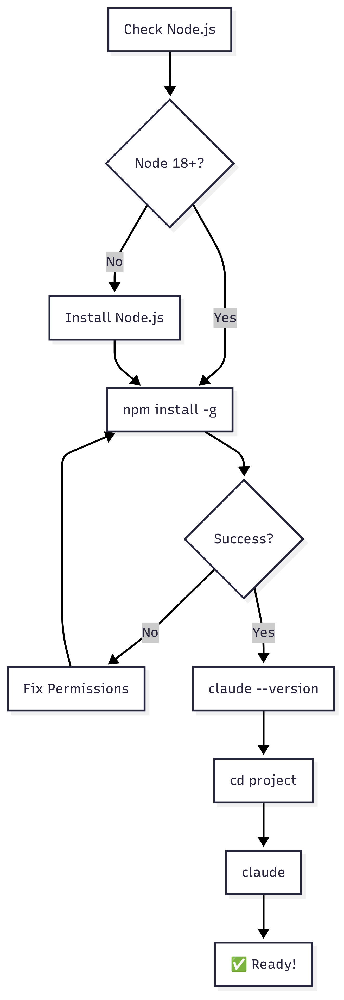

# 📦 Claude Code Installation

> **Intent**: Get Claude Code installed and running in under 5 minutes with minimal commands

## Prerequisites
```bash
node --version  # Need 18+
```

## Install
```bash
npm install -g @anthropic-ai/claude-code
```

## Verify
```bash
claude --version
claude doctor
```

## First Run
```bash
cd your-project
claude
# Follow browser authentication
```

## Common Issues

**Permission error?**
```bash
npm config set prefix ~/.npm-global
export PATH=~/.npm-global/bin:$PATH
```

**Node.js too old?**
```bash
nvm install --lts
nvm use --lts
```

**Windows?**
```bash
# Use WSL
wsl --install
```

## Installation Flow



---

**Next:** → [Configuration](../02-claude-configuration/1-README.md)
