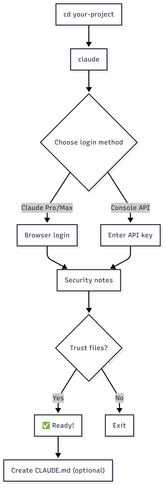

# ⚙️ Claude Code Configuration

> **Intent**: Configure authentication and project context in 3 steps

## First Time Setup
```bash
cd your-project
claude
# Follow prompts to choose login method
```

## Authentication Options
**Option 1: Claude Pro/Max** (Recommended)
- Choose option 1
- Browser opens for login

**Option 2: Anthropic Console**
- Choose option 2  
- Enter API key when prompted

## Trust Project Files
```bash
# When prompted "Do you trust the files in this folder?"
# Choose: 1. Yes, proceed
```

## Create Project Context (Optional)
```bash
# Auto-generate with /init (recommended)
claude "/init"

# Or create manually
echo "## Project Overview
[Brief description]

## Tech Stack  
- Language: [your language]
- Framework: [your framework]

## Build Commands
- npm run build
- npm test

## Code Style
- Use TypeScript
- ESLint + Prettier" > CLAUDE.md
```

## Configuration Flow



---

**Next:** → [Bootstrap Prerequisites](../03-bootstrap-project/0-prerequisites.md)