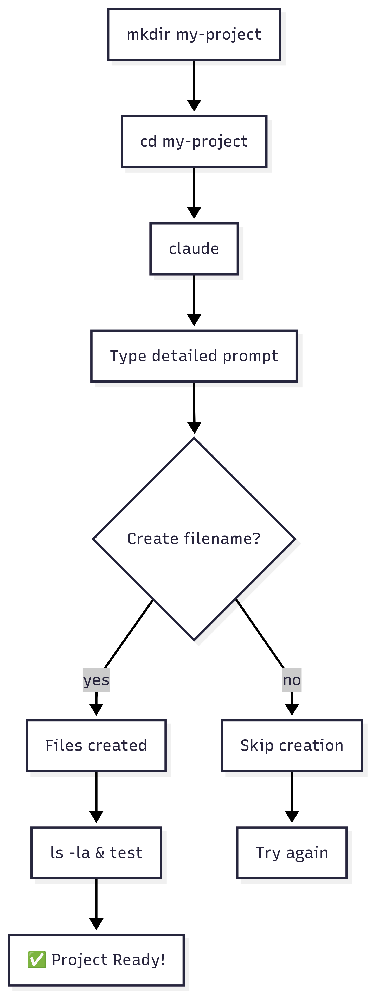

# 🎯 Bootstrap New Project

> **Intent**: Create new project from scratch in 3 steps

## Create Project
```bash
mkdir my-project
cd my-project
claude
```

## Give Detailed Prompt

**Template:**
```
Create a [language] [type] that:
- [feature 1]
- [feature 2]  
- [feature 3]
```

**Example:**
```
Create a Python calculator that:
- Adds, subtracts, multiplies, divides
- Has colorful output
- Handles division by zero
```

**Expected Output:**
```
✓ Creates calculator.py
✓ Math functions
✓ Error handling
✓ Colored print statements
```

## Allow File Creation
```bash
# When asked "Do you want to create filename?"
# Type: y
```

## Test
```bash
ls -la
# Run your project
```

## Bootstrap Flow



---

**Next:** → [Existing Project Integration](../04-existing-project/1-README.md)
