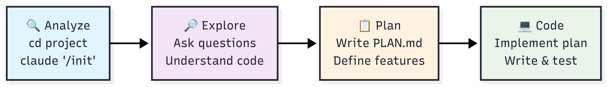

# 🔄 Existing Project Integration

> **Intent**: Add features to any existing project in 4 simple steps

## 1. Explore
```bash
# Go to your existing project folder
cd your-existing-project
# OR: cd ~/Documents/my-python-game

claude "Read my code and tell me what this app does"
# Claude will analyze all your files and explain the project
```

## 2. Plan  
```bash
claude "Write a plan to add these features:
- [feature 1]
- [feature 2] 
- [feature 3]
Save the plan to PLAN.md"
```

## 3. Code
```bash
claude "Follow the plan in PLAN.md and write the code"
```

## 4. Commit
```bash
claude "Update README and make a git commit with the changes"
```

**Example Features to Add:**
- Save data permanently
- Edit existing items  
- Make it look prettier

## Pro Tips

### Quick Commands
```bash
# Ask about specific files
claude "How does myFile.js work?"

# Get quick answers (headless mode)
claude -p "How many files are in this project?"

# Chain with other tools
cat data.csv | claude -p "What's the summary?"
```

### Use Images
```bash
# Copy screenshot (Mac: Shift+Cmd+Ctrl+4)
# Paste in Claude: Ctrl+V
claude "Make this UI look better" # with pasted screenshot
```

### Auto-Generate CLAUDE.md
```bash
# Creates project memory file
claude "/init"
```

### Think Harder for Complex Problems
```bash
# For simple analysis
claude "think about this bug"

# For complex problems  
claude "think harder about this architecture decision"

# For very complex issues
claude "ultrathink this refactoring strategy"
```

### Custom Commands (Advanced)
```bash
# Create reusable commands
mkdir -p .claude/commands
echo "Fix this GitHub issue: $ARGUMENTS" > .claude/commands/fix-issue.md

# Use the command
claude "/project:fix-issue #123"
```

## Integration Flow



---

**Next:** → [Debugging Prerequisites](../05-debugging/0-prerequisites.md)
